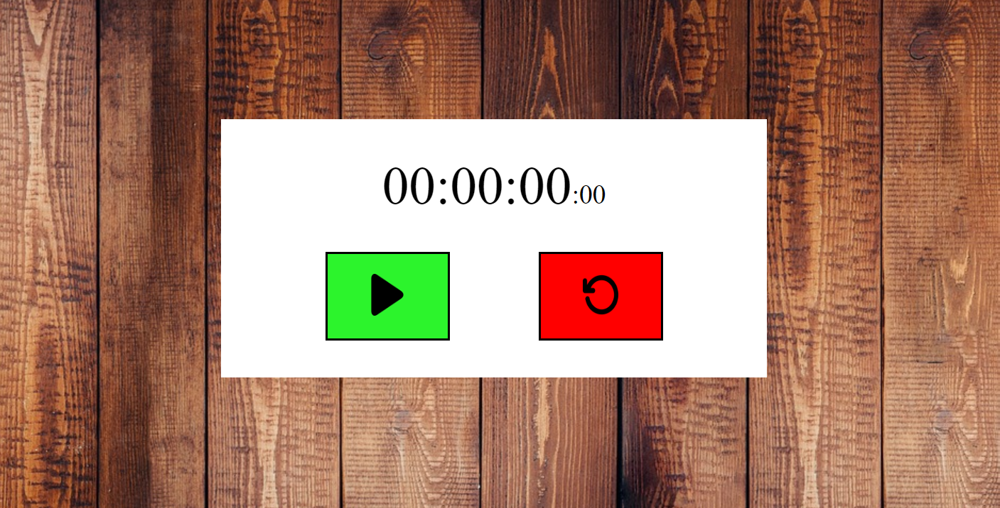

# Citas Célebres Generales.

[Ver el proyecto desplegado aquí](https://melodious-sherbet-6260f8.netlify.app/)

## Tabla de Contenidos

- [Descripción](#descripción)
- [Capturas de Pantalla](#capturas-de-pantalla)
- [Instalación](#instalación)
- [Uso](#uso)
- [Tecnologías Utilizadas](#tecnologías-utilizadas)
- [Autor](#autor)
- [Agradecimientos](#agradecimientos)

## Descripción

Este proyecto es una página web desarrollado con HTML, CSS y JavaScript donde se ha creado un cronómetro.

## Capturas de Pantalla

### Vista de Escritorio


## Instalación

Para instalar y ejecutar este proyecto localmente, sigue estos pasos:

1. Clona el repositorio
    ```bash
    git clone https://github.com/tu-usuario/tu-repositorio.git
    ```
2. Navega al directorio del proyecto
    ```bash
    cd tu-repositorio
    ```
3. Abre `index.html` en tu navegador preferido

## Uso

Al acceder a la página, puedes iniciar, pausar o reiniciar el cronómetro.

## Tecnologías Utilizadas

- HTML5
- CSS3
- JavaScript

## Autor

- Portfolio - Fernando Vera (https://benevolent-frangipane-800c24.netlify.app/)
- Frontend Mentor - @FVeraCoding (https://www.frontendmentor.io/profile/FVeraCoding)
- GitHub - @FVeraCoding (https://github.com/FVeraCoding)

---
